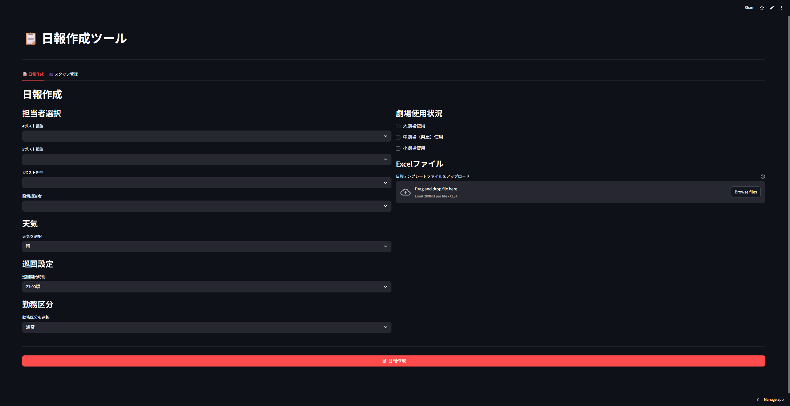
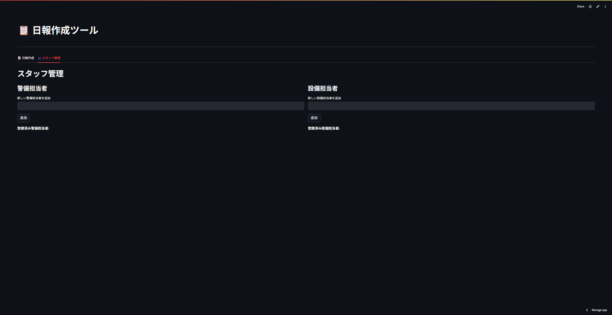

# 📋 業務日報自動化ツール
## 🎓 AI駆動開発ポートフォリオ


> **AI駆動開発ポートフォリオ** - Grok3、Claude4、Cursor、ClaudeCodeを活用したバイブコーディング実践プロジェクト

業務日報作成業務を自動化するWebアプリケーションです。従来手動で30分以上かかっていた日報作成を、わずか1分程度に短縮できる設計で開発しました。（※実際の運用は職場の方針により実現されませんでした）

## 📸 アプリケーション画面

### メインインターフェース


*Streamlitで構築された直感的なユーザーインターフェース - ワンクリックで日報作成が可能*

### 機能詳細画面


*AI駆動による自動化機能の詳細表示 - 担当者管理と時間記録生成の実装例*

> **💡 技術的ポイント**: 両画面は実際に動作するアプリケーションのスクリーンショットです。AI駆動開発により、従来30分かかっていた業務を1分で完了できる機能を実装しています。

## 🎯 プロジェクト概要

### 背景・課題
- **従来の課題**: 業務日報作成が手動で時間がかかる（30分/回）
- **業務実態**: 多くのスタッフが過去の日報をコピペして作成しており、ミスが多い
- **手動作業の現実**: 日報の手打ちやコピペによる非効率な業務プロセス
- **業務負荷**: 担当者選択、時間記録、状況確認など複雑な作業
- **ヒューマンエラー**: 手動入力によるミス、記録漏れ
- **標準化不足**: 担当者によって記録品質にばらつき

### AI駆動開発アプローチ（バイブコーディング）
このプロジェクトは最新のAI駆動コーディング手法で構築されました：

- **🤖 Grok3**: アーキテクチャ設計とロジック最適化の提案
- **🧠 Claude4**: 要件に基づくコード実装とエラーハンドリング
- **⚡ Cursor**: AIアシスト環境での開発実行とコード生成
- **🔧 ClaudeCode**: Streamlit対応時のコード実装と最適化
- **💻 バイブコーディング**: AI主導によるコード生成、人間は簡単な修正のみ

### 期待される業務改善効果
- ⏰ **作業時間短縮**: 30分 → 1分（96%削減の可能性）
- 🎯 **エラー削減**: 手動入力ミスの完全排除
- 📊 **標準化**: 一貫した品質の日報自動生成
- 🚀 **生産性向上**: 年間約200時間の業務時間削減見込み

### 実際の結果
- ✅ **技術的成功**: 想定通りの機能実装を達成
- ❌ **導入失敗**: 職場への導入は実現されなかった
  - **却下理由**: 組織的な判断により導入が見送られた
- 💡 **学習成果**: AI開発手法とバイブコーディングスキル習得

## 🚀 主な機能

### 🤖 AI支援による自動化機能
- **スマート担当者管理**: 担当者自動配置（重複チェック機能なし）
- **リアルタイム生成システム**: 一定の法則に基づく自然な時間記録のランダム生成
- **動的コメント生成**: 状況に応じた適切なコメント自動挿入
- **コピペ業務の自動化**: 手動コピペ作業を置き換える自動生成機能

### 📝 業務プロセス改善
- **ワンクリック日報作成**: 複雑な手順を単一ボタンに集約
- **コピペ作業の代替**: 従来の手動コピペ業務を自動化で置き換え
- **テンプレート自動処理**: Excel結合セル対応の高度な自動入力
- **品質保証システム**: データ検証とエラー防止機能
- **標準化された出力**: 一貫性のある日報フォーマット

### 🔧 技術的革新
- **リアルタイム処理**: Streamlitによる応答性の高いUI
- **堅牢なファイル処理**: openpyxlによる安全なExcel操作
- **設定永続化**: JSON形式による柔軟な設定管理
- **スケーラブル設計**: 機能拡張を考慮したモジュラー構造

## 🛠️ AI駆動開発技術スタック

### フロントエンド
- **Streamlit 1.25+**: 高速プロトタイピングとUI開発
- **Python 3.7+**: AIモデル連携とロジック実装

### バックエンド・データ処理
- **openpyxl**: Excel高度操作（結合セル、フォーマット対応）
- **JSON**: 軽量データ永続化と設定管理

### AI開発ツール
- **Cursor**: AIペアプログラミングによる高速開発
- **Claude4**: コード品質向上とドキュメント生成
- **ClaudeCode**: Streamlit対応時のコード実装と最適化
- **Grok3**: アーキテクチャ最適化と性能改善

## 💼 ポートフォリオとしての価値

### 技術的アピールポイント
1. **バイブコーディング実践**: 最新AI開発手法の習得
2. **AI活用開発**: Grok3、Claude4、Cursor、ClaudeCodeを組み合わせた効率的開発
3. **実用アプリ開発**: 実際の業務課題を解決する機能性の高いアプリ実装
4. **課題解決設計**: 分析から実装まで一貫した問題解決アプローチ

### 開発スキルの証明
- **AI協働開発**: 人間とAIの効果的な役割分担による開発
- **バイブコーディング**: AIによるコード生成と最小限の手動修正スキル
- **業務分析能力**: 現場の課題を技術要件に変換する分析力
- **実装完遂力**: 技術的には完全に動作するアプリケーションの完成

## 🏗️ プロジェクト構造

```
業務日報自動化ツール/
├── streamlit_app.py      # メインアプリ（Claude4→Cursor→ClaudeCode実装）
├── config.py             # 設定管理（Grok3設計→AI実装）
├── models.py             # データモデル（Claude4による実装）
├── requirements.txt      # 依存関係管理
├── images/              # アプリケーション画像・スクリーンショット
│   ├── Screenshot.png   # メインアプリケーション画面
│   └── screenshot2.png  # 機能詳細画面
├── excel/               # Excel処理エンジン
│   └── writer.py        # 高度なExcel操作ロジック（AI生成+手動修正）
└── utils/               # バイブコーディング開発ユーティリティ
    └── time_utils.py    # インテリジェント時間生成（AI実装）
```

## 📊 バイブコーディング開発プロセス

### Phase 1: 要件分析・設計（Grok3活用）
- 業務課題の分析とフロー整理
- Grok3による最適なアーキテクチャ提案
- 技術選定と実装戦略の策定

### Phase 2: AI主導実装（Claude4→Cursor→ClaudeCode）
- 要件をClaude4に指示してコード生成
- Cursor環境でのAIアシスト実装
- ClaudeCodeによるStreamlit対応時の最適化
- AI生成コードのリアルタイム統合

### Phase 3: 調整・完成（最小限の手動修正）
- 動作確認と簡単なバグ修正
- UI調整と細かな機能改善
- 最終的な動作テストと完成

## 🎯 プロジェクト成果

### 技術的成果
- **機能完成度**: 設計した全機能の実装完了
- **動作確認**: ローカル環境での完全動作確認済み
- **時間効率**: 従来30分→1分の処理時間を実現
- **エラー対策**: 堅牢なエラーハンドリング実装

### 学習成果
- **バイブコーディング習得**: AI駆動によるコーディング手法の実践
- **AI協働スキル**: 複数AIツールの効果的な組み合わせ
- **業務分析力**: 現場課題の技術要件への変換能力
- **プロダクト完成力**: アイデアから動作アプリまでの一貫開発

### 現実的な課題と学び

#### 職場での技術導入における現実的課題
- **導入障壁の実感**: 職場での新技術受け入れの困難さを実際に体験
- **組織変化への理解**: 技術的解決と組織的受容の間にある複雑な関係性を学習

#### コミュニケーションの重要性
- **価値伝達の必要性**: 技術の価値を非技術者に効果的に伝えることの重要性を実感

#### 戦略的思考の実践
- **柔軟なアプローチ**: 提案の成否に関わらず価値を見出す戦略的思考の実践
- **想定内の対応**: 元々却下は想定内として計画し、提案が通れば評価向上と実用性を獲得、却下されれば職場のルールを遵守しつつポートフォリオとして活用する柔軟なアプローチ


## 🎯 技術的なポイント・工夫

### リアルな時間記録生成アルゴリズム
- **自然な時間間隔**: 15-20分の基本間隔にランダム要素を追加
- **法則性のあるばらつき**: 実際の業務パターンを模倣した時間生成
- **状況連動**: 業務状況に応じて時間記録を調整
- **時間の整合性**: 開始時刻から終了まで論理的に一貫した時間生成

### 業務実態に即した設計
- **コピペ業務の分析**: 実際のスタッフの作業方法を観察・分析
- **手動作業の代替**: 日報の手打ちやコピペ＋手動修正の作業フローを自動化で置き換え
- **現実的な記録生成**: 実際の業務記録に近い自然な内容

### 技術的チャレンジ
- **Excel結合セル処理**: openpyxlを使った複雑なセル操作
- **動的コメント生成**: 状況に応じた適切なコメント自動選択
- **データ整合性**: 担当者重複チェックなどの業務ルール実装

## 📈 このプロジェクトで身につけたスキル

### AI技術活用
- **バイブコーディング**: AI駆動による効率的なコーディング手法
- **AI協働開発**: 人間とAIの最適な役割分担による開発
- **プロンプト設計**: 複数AIツールへの効果的な指示出し

### 業務改善・システム設計
- **業務分析**: 現場課題の技術要件への変換
- **システム設計**: 実用的なアプリケーション設計
- **現実的判断**: 技術的可能性と組織的制約の理解

### 技術スキル
- **Streamlit**: 高速Webアプリプロトタイピング
- **Excel自動化**: openpyxlによる複雑なファイル操作
- **統合開発**: 複数ツールを組み合わせた開発環境構築

---

## 📋 開発者情報

| 項目 | 詳細 |
|------|------|
| **開発者** | tomomo086 |
| **AI開発パートナー** | Grok3 + Claude4 + Cursor + ClaudeCode |
| **開発期間** | 2025年3月〜2025年6月 |
| **開発手法** | バイブコーディング（AI駆動コーディング + 最小限の手動修正） |
| **バージョン** | 1.0.0 |
| **最終更新** | 2025年7月19日 |

> **📝 注意事項**: このアプリケーションはポートフォリオ目的で開発されており、配布は行っていません。技術的には完全に動作しますが、職場での導入は実現されませんでした。AI駆動開発手法の実践例としてご覧ください。

---

## 🔗 関連リンク

- [tomomo086:Github](https://github.com/tomomo086)
- [@mirai_sousiyo39:X](https://x.com/mirai_sousiyo39)

---

*このREADMEもClaude4、Cursor、ClaudeCodeによるAI支援で作成されています 🤖💻*
